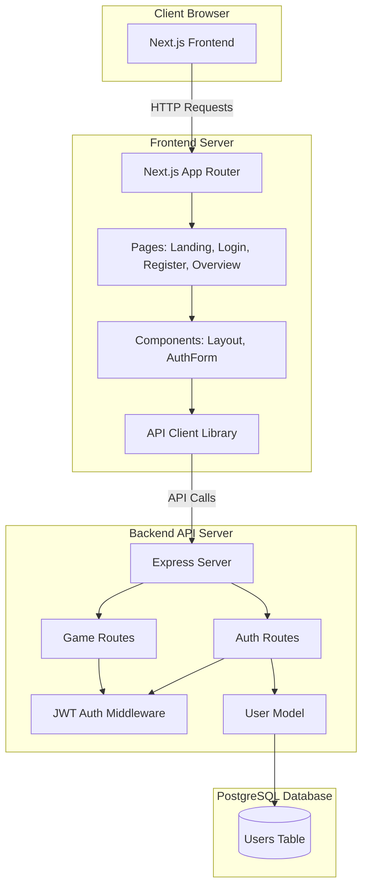
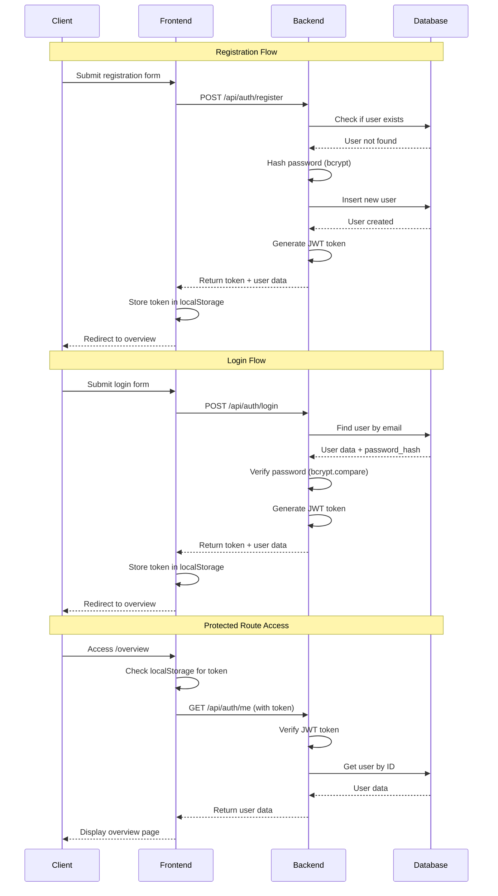

# Corporate Sim Game - System Architecture

## Overview

Corporate Sim is a multiplayer corporate simulation game built as a full-stack web application. Players engage in hourly turn-based gameplay, building production, retail, and service units while choosing integration strategies, labor policies, and sector focuses.

## System Architecture Diagram



## Technology Stack

### Frontend
- **Next.js 14+**: React framework with App Router for server-side rendering and routing
- **React 18**: UI library for building interactive components
- **TypeScript**: Type-safe JavaScript for better developer experience
- **Tailwind CSS**: Utility-first CSS framework for rapid UI development
- **Axios**: HTTP client for API communication

**Rationale**: Next.js provides excellent developer experience with built-in routing, SSR capabilities, and API routes. Tailwind CSS enables rapid prototyping while maintaining professional design. TypeScript adds type safety to catch errors early.

### Backend
- **Node.js**: JavaScript runtime environment
- **Express**: Minimal web framework for building REST APIs
- **TypeScript**: Type safety for backend code
- **PostgreSQL**: Relational database for structured data
- **pg**: PostgreSQL client for Node.js
- **bcryptjs**: Password hashing library
- **jsonwebtoken**: JWT token generation and verification
- **cors**: Cross-origin resource sharing middleware

**Rationale**: Express is lightweight and well-suited for REST APIs. PostgreSQL provides ACID compliance and relational integrity crucial for game state management. JWT tokens enable stateless authentication suitable for scaling.

### Database
- **PostgreSQL**: Open-source relational database

**Rationale**: PostgreSQL offers strong consistency guarantees, complex query capabilities, and excellent performance for structured game data. It's ideal for managing user accounts, game state, transactions, and relationships between entities.

## File Structure

```
corporate-sim/
├── frontend/                    # Next.js frontend application
│   ├── app/                    # App Router directory
│   │   ├── page.tsx            # Landing page
│   │   ├── login/
│   │   │   └── page.tsx        # Login page
│   │   ├── register/
│   │   │   └── page.tsx        # Registration page
│   │   ├── overview/
│   │   │   └── page.tsx        # Game overview (protected)
│   │   ├── layout.tsx          # Root layout
│   │   └── globals.css         # Global styles
│   ├── components/             # Reusable React components
│   │   ├── Layout.tsx          # Main layout wrapper with navigation
│   │   └── AuthForm.tsx        # Shared authentication form
│   ├── lib/                    # Utility libraries
│   │   └── api.ts              # API client with axios
│   ├── package.json            # Frontend dependencies
│   ├── tsconfig.json           # TypeScript configuration
│   ├── tailwind.config.js      # Tailwind CSS configuration
│   └── next.config.js          # Next.js configuration
│
├── backend/                     # Express API server
│   ├── src/
│   │   ├── routes/             # API route handlers
│   │   │   ├── auth.ts         # Authentication endpoints
│   │   │   └── game.ts         # Game endpoints (placeholder)
│   │   ├── middleware/         # Express middleware
│   │   │   └── auth.ts         # JWT authentication middleware
│   │   ├── models/             # Data models
│   │   │   └── User.ts         # User model with database operations
│   │   ├── db/                 # Database configuration
│   │   │   └── connection.ts   # PostgreSQL connection pool
│   │   └── server.ts           # Express server setup
│   ├── migrations/             # Database migrations
│   │   └── 001_initial.sql     # Initial schema
│   ├── package.json            # Backend dependencies
│   └── tsconfig.json           # TypeScript configuration
│
├── architecture.md             # This file
├── package.json                # Root package.json with workspaces
└── README.md                   # Project documentation
```

## Database Schema

### Users Table

```sql
CREATE TABLE users (
    id SERIAL PRIMARY KEY,
    email VARCHAR(255) UNIQUE NOT NULL,
    username VARCHAR(100) UNIQUE NOT NULL,
    password_hash VARCHAR(255) NOT NULL,
    created_at TIMESTAMP DEFAULT CURRENT_TIMESTAMP
);

CREATE INDEX idx_users_email ON users(email);
CREATE INDEX idx_users_username ON users(username);
```

**Schema Rationale**:
- `id`: Primary key for user identification
- `email`: Unique identifier for login, indexed for fast lookups
- `username`: Display name, unique and indexed
- `password_hash`: Bcrypt-hashed password (never store plaintext)
- `created_at`: Timestamp for account creation tracking

## API Endpoints

### Authentication Endpoints

#### POST `/api/auth/register`
Register a new user account.

**Request Body**:
```json
{
  "email": "user@example.com",
  "username": "username",
  "password": "password123"
}
```

**Response** (201 Created):
```json
{
  "token": "jwt_token_here",
  "user": {
    "id": 1,
    "email": "user@example.com",
    "username": "username"
  }
}
```

**Errors**:
- `400`: Missing fields, password too short, or user already exists
- `500`: Internal server error

#### POST `/api/auth/login`
Authenticate user and receive JWT token.

**Request Body**:
```json
{
  "email": "user@example.com",
  "password": "password123"
}
```

**Response** (200 OK):
```json
{
  "token": "jwt_token_here",
  "user": {
    "id": 1,
    "email": "user@example.com",
    "username": "username"
  }
}
```

**Errors**:
- `400`: Missing email or password
- `401`: Invalid credentials
- `500`: Internal server error

#### GET `/api/auth/me`
Get current authenticated user information.

**Headers**:
```
Authorization: Bearer <jwt_token>
```

**Response** (200 OK):
```json
{
  "id": 1,
  "email": "user@example.com",
  "username": "username",
  "created_at": "2024-01-01T00:00:00Z"
}
```

**Errors**:
- `401`: Missing or invalid token
- `403`: Token expired
- `404`: User not found
- `500`: Internal server error

### Game Endpoints

#### GET `/api/game/status`
Placeholder endpoint for game status (protected).

**Headers**:
```
Authorization: Bearer <jwt_token>
```

**Response** (200 OK):
```json
{
  "message": "Game API - Coming soon"
}
```

## Authentication Flow



## Component Architecture

### Frontend Components

#### Layout Component (`components/Layout.tsx`)
- Provides consistent navigation bar
- Handles routing between pages
- Conditionally shows login/register buttons based on current route

#### AuthForm Component (`components/AuthForm.tsx`)
- Reusable form component for both login and register
- Handles form state, validation, and submission
- Displays error messages
- Manages loading states
- Stores JWT token in localStorage on success

#### Page Components
- **Landing Page** (`app/page.tsx`): Marketing page with game features and CTAs
- **Login Page** (`app/login/page.tsx`): Login form wrapper
- **Register Page** (`app/register/page.tsx`): Registration form wrapper
- **Overview Page** (`app/overview/page.tsx`): Protected page showing game mechanics overview

### API Client (`lib/api.ts`)
- Centralized axios instance with base URL configuration
- Request interceptor adds JWT token to headers
- Exports `authAPI` object with authentication methods
- Handles API communication between frontend and backend

## Security Considerations

### Password Security
- Passwords are hashed using bcryptjs with 10 salt rounds
- Plaintext passwords are never stored in the database
- Minimum password length of 6 characters enforced

### JWT Tokens
- Tokens expire after 24 hours
- Secret key stored in environment variables
- Tokens include user ID and email in payload
- Middleware verifies tokens on protected routes

### CORS Configuration
- Backend configured to accept requests from frontend origin only
- Credentials enabled for cookie-based authentication (future)

### Environment Variables
- Database connection string stored in `.env`
- JWT secret stored in `.env` (never committed)
- Frontend API URL configurable via environment variables

## Future Scalability Considerations

### Multiplayer Game Features

#### Real-Time Updates
- **WebSocket Integration**: Add Socket.io or native WebSockets for real-time game state updates
- **Server-Sent Events (SSE)**: Alternative for one-way server-to-client updates
- **Polling**: Fallback mechanism for clients without WebSocket support

#### Game State Management
- **Redis**: Add Redis for caching and session management
- **Message Queue**: Use RabbitMQ or AWS SQS for turn processing
- **Database Optimization**: Add indexes for game queries, consider read replicas

#### Turn Processing
- **Job Queue**: Implement Bull or similar for processing hourly turns
- **Cron Jobs**: Schedule turn processing every hour
- **Batch Processing**: Process multiple players' turns in parallel

#### Horizontal Scaling
- **Load Balancing**: Use nginx or cloud load balancer
- **Stateless Design**: Current JWT-based auth supports stateless scaling
- **Database Connection Pooling**: Already implemented with pg Pool
- **Microservices**: Consider splitting game logic into separate services

#### Data Architecture for Game Entities
Future tables to consider:
- `companies`: Player corporations
- `units`: Production/retail/service units
- `turns`: Turn history and state
- `transactions`: Financial transactions
- `market_data`: Market conditions and prices
- `player_actions`: Actions taken by players

#### Caching Strategy
- Cache frequently accessed game data (market prices, leaderboards)
- Use Redis for session storage and real-time data
- Implement cache invalidation on game state changes

#### Performance Optimization
- Database query optimization with proper indexes
- API response pagination for large datasets
- Lazy loading for game components
- CDN for static assets

### Monitoring & Observability
- Add logging framework (Winston, Pino)
- Implement error tracking (Sentry)
- Add performance monitoring (New Relic, DataDog)
- Database query monitoring and slow query logging

## Development Workflow

1. **Local Development**:
   - Frontend: `npm run dev:frontend` (runs on port 3000)
   - Backend: `npm run dev:backend` (runs on port 3001)
   - Database: PostgreSQL running locally

2. **Database Migrations**:
   - Run SQL migrations manually or use migration tool (e.g., node-pg-migrate)
   - Migrations stored in `backend/migrations/`

3. **Environment Setup**:
   - Copy `.env.example` to `.env` in backend directory
   - Configure `DATABASE_URL` and `JWT_SECRET`
   - Set `NEXT_PUBLIC_API_URL` in frontend `.env.local`

## Deployment Considerations

### Frontend Deployment
- Next.js can be deployed to Vercel, Netlify, or any Node.js hosting
- Static export possible for fully static deployment
- Environment variables configured in hosting platform

### Backend Deployment
- Deploy to Node.js hosting (Heroku, Railway, AWS EC2, etc.)
- Ensure PostgreSQL database is accessible
- Set environment variables in hosting platform
- Consider using managed PostgreSQL (AWS RDS, Heroku Postgres, etc.)

### Database Deployment
- Use managed PostgreSQL service for production
- Set up automated backups
- Configure connection pooling limits
- Monitor database performance

## Conclusion

This architecture provides a solid foundation for a multiplayer corporate simulation game. The separation of concerns between frontend and backend, along with JWT-based authentication, enables scalable development. As the game grows, the architecture can be extended with real-time features, caching layers, and optimized database schemas for game entities.


